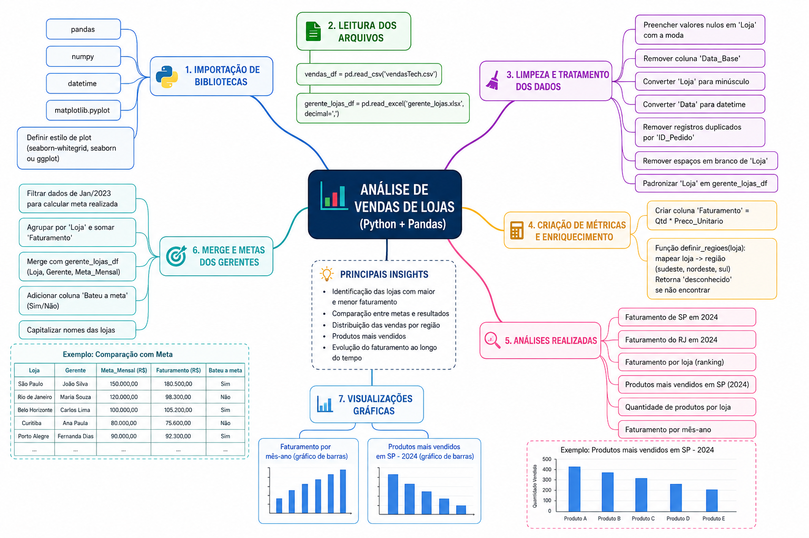

# 📊 Análise de Vendas de Rede de Lojas

Projeto de **Análise Exploratória de Dados (EDA)** desenvolvido em Python para transformar dados de vendas em indicadores e insights de negócio.

## 🎯 Problema de negócio

A análise busca responder perguntas como:

- Quais lojas apresentam maior e menor faturamento?
- Quais produtos possuem maior volume de vendas?
- Quais lojas atingiram suas metas?
- Como o faturamento evolui ao longo do tempo?
- Como as vendas se distribuem por cidade e região?

## 🛠️ Tecnologias

- Python
- Pandas
- NumPy
- Matplotlib
- Jupyter Notebook

## 🔄 Processo de análise

**Dados brutos → Limpeza → Tratamento → Métricas → EDA → Visualização → Insights**

### Tratamento dos dados

- Tratamento de valores nulos
- Conversão e padronização de datas
- Padronização de dados textuais
- Remoção de duplicidades
- Ajuste de tipos de dados
- Integração das informações de vendas, lojas e metas

### Métricas e análises

- Faturamento por loja
- Faturamento por cidade e região
- Produtos mais vendidos
- Evolução mensal das vendas
- Comparação entre faturamento e metas
- Ranking de desempenho das lojas

## 📈 Visualizações

O projeto utiliza gráficos para facilitar a interpretação dos principais indicadores, incluindo ranking de lojas, produtos mais vendidos e evolução do faturamento.

<p align="center">
  
</p>

## 💡 Resultados

A análise permite identificar diferenças de desempenho entre lojas, produtos de maior saída, evolução do faturamento e lojas que atingiram ou não seus objetivos comerciais.

## 🚀 Como executar

```bash
git clone https://github.com/DevCleyt/Analise-de-dados-Vendas-loja.git
cd Analise-de-dados-Vendas-loja
pip install pandas numpy matplotlib openpyxl jupyter
jupyter notebook
```

Depois, abra o notebook `analiseLoja.ipynb`.

## 📚 Conceitos aplicados

- Análise Exploratória de Dados (EDA)
- Limpeza e tratamento de dados
- Manipulação com Pandas
- GroupBy e agregações
- Merge entre bases
- Filtros e máscaras
- Criação de indicadores de negócio
- Visualização de dados

## 👨‍💻 Autor

**Cleyton Pereira dos Santos** — Tecnólogo em Análise e Desenvolvimento de Sistemas.

Foco atual: **Python • Dados • SQL • Automação • IA**

[GitHub](https://github.com/DevCleyt)
